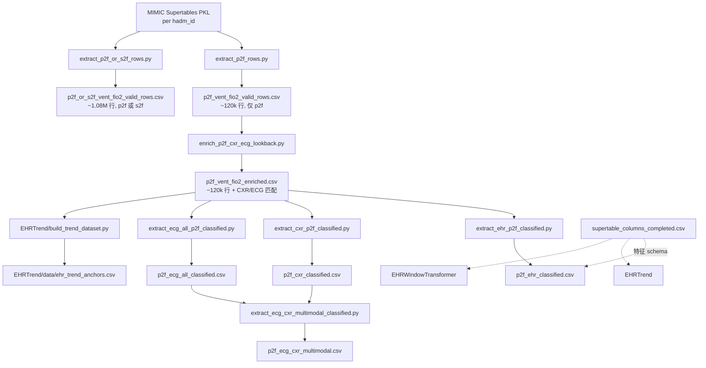

# Waveform_CXR_EHR

MIMIC-IV **EHR supertable** 与 **CXR**、**ECG waveform** 的对齐、特征抽取，以及 ARDS 严重程度 / 趋势预测实验。

本仓库的核心任务：以 EHR 时间序列行为 anchor，在 anchor 前 **6–18 小时** 回看窗口内匹配 CXR / ECG，用于单模态与多模态 baseline 和 Transformer 实验。

---

## 仓库结构

```
Waveform_CXR_EHR/
├── data/                          # 数据抽取脚本 + 主要 CSV（见下文）
├── supertable_columns_completed.csv   # EHR 特征 schema（与 data/ 下同名文件相同）
├── BaselineExperiment/            # ARDS 三分类 baseline（EHR / CXR / ECG / 多模态）
├── EHRTrend/                      # p2f/s2f 趋势预测、next-step、forward MLP
├── EHRWindowTransformer/          # 基于 anchor + history window 的 Transformer
├── models/encoders/               # 共享 EHR / CXR / ECG encoder
└── experiment1(old)/              # 旧版 CXR–supertable–waveform 全量匹配（已归档）
```

---

## 关键概念

| 术语 | 含义 |
|------|------|
| **Supertable** | MIMIC-IV 按 `hadm_id` 存储的宽表 PKL，每行一个 EHR 时间点（`index` 列 = 时间戳） |
| **p2f_vent_fio2** | PaO₂/FiO₂（氧合指数），ARDS 分级的核心指标 |
| **s2f_vent_fio2** | SpO₂/FiO₂（饱和度氧合指数），p2f 的替代/补充指标 |
| **p2f_class** | ARDS 严重程度三分类：`0=Severe (<100)`，`1=Moderate (100–200)`，`2=Mild (200–300)`；`>300` 或缺失则排除 |
| **CXR_signal / ECG_signal** | 该行在 `[anchor−18h, anchor−6h]` 内是否成功匹配到 CXR / ECG（0/1） |
| **Anchor** | 模型预测的目标时间点（通常是一条有 p2f 或 s2f 的 supertable 行） |
| **History** | anchor 之前若干小时内的 EHR 序列，供 Transformer / trend 模型使用 |

---

## 数据流水线



> **注意**：当前 `p2f_vent_fio2_enriched.csv` 由 **p2f-only** 抽取（120k 行）生成。更新的 `p2f_or_s2f_vent_fio2_valid_rows.csv`（1M+ 行）主要用于 **EHRTrend / EHRWindowTransformer** 的 anchor 与标签，尚未重新跑 enrich。

---

## `data/` 目录 CSV 说明

### 1. 原始抽取（来自 Supertables）

| 文件 | 行数（约） | 生成脚本 | 含义 |
|------|-----------|----------|------|
| `p2f_vent_fio2_valid_rows.csv` | 120,060 | `data/extract_p2f_rows.py` | 所有 **`p2f_vent_fio2` 非空** 的 supertable 行；166 列 EHR 特征 + `hadm_id` |
| `p2f_or_s2f_vent_fio2_valid_rows.csv` | 1,076,516 | `data/extract_p2f_or_s2f_rows.py` | **`p2f_vent_fio2` 或 `s2f_vent_fio2` 至少一个非空**；在 p2f-only 基础上多了 `has_s2f_vent_fio2`、`has_p2f_vent_fio2`、`s2f/p2f_vent_fio2_severity`、`*_severity_change_12to24h` 等列；**EHRTrend / EHRWindowTransformer 的 anchor 表** |

两者共同列：`index`（时间戳）、 demographics、labs、vitals、vent、SOFA 等 supertable 全部 EHR 字段。

### 2. 模态 enrich（CXR + ECG 回看匹配）

| 文件 | 行数（约） | 生成脚本 | 含义 |
|------|-----------|----------|------|
| `p2f_vent_fio2_enriched.csv` | 120,060 | `data/enrich_p2f_cxr_ecg_lookback.py` | 在 p2f-only 行上，为每个 anchor 在 **[t−18h, t−6h]** 内找最近 CXR / ECG；新增 `dicom_id`、`subject_id`、`supertable_datetime`、`wf_*`（波形路径等）、`CXR_signal`、`ECG_signal` |

Lookback 窗口与 enrich 脚本一致（6–18 小时，非 README 旧版写的 6–12h）。

### 3. ARDS 三分类子集（baseline 用）

均在 `p2f_vent_fio2_enriched.csv` 基础上过滤，并添加 **`p2f_class`** 列：

| 文件 | 行数（约） | 生成脚本 | 过滤条件 | 用途 |
|------|-----------|----------|----------|------|
| `p2f_ehr_classified.csv` | 87,661 | `data/extract_ehr_p2f_classified.py` | p2f 在 ARDS 范围 (≤300) | **EHR-only** baseline |
| `p2f_cxr_classified.csv` | 7,543 | `data/extract_cxr_p2f_classified.py` | `CXR_signal=1` + 有效 `dicom_id` + p2f_class | **CXR-only** baseline |
| `p2f_ecg_all_classified.csv` | 2,115 | `data/extract_ecg_all_p2f_classified.py` | `ECG_signal=1`；**展开** lookback 内全部 ECG（非 enrich 的“最近一条”） | **ECG-only** baseline |
| `p2f_ecg_cxr_multimodal.csv` | 2,115 | `data/extract_ecg_cxr_multimodal_classified.py` | `p2f_cxr_classified` 与 `p2f_ecg_all_classified` 按 **`index` 内连接** | **ECG+CXR** 多模态 baseline |

`p2f_class` 映射：

- `0` Severe：p2f < 100  
- `1` Moderate：100 ≤ p2f < 200  
- `2` Mild：200 ≤ p2f ≤ 300  

### 4. 特征 schema（不是患者数据）

| 文件 | 行数 | 含义 |
|------|------|------|
| `data/supertable_columns_completed.csv` | 162 | 每个 EHR 列的 **dtype、是否 one-hot、imputation、normalization、是否作为模型输入** 等；训练 EHR encoder / Transformer 时读取 |
| `supertable_columns_completed.csv`（仓库根目录） | 162 | 与 `data/` 下 **内容相同** 的副本；部分脚本从根目录解析 project root |

### 5. EHRTrend 专用

| 文件 | 行数（约） | 生成脚本 | 含义 |
|------|-----------|----------|------|
| `EHRTrend/data/ehr_trend_anchors.csv` | 118,409 | `EHRTrend/build_trend_dataset.py` | 从 enriched CSV 构建的 **趋势 anchor**：每行含 `subject_id`、`index`、`p2f_vent_fio2`、`prev_state`、`curr_state`、`trend_label`（0=decrease, 1=remain, 2=increase）、`n_window_points` |

---

## 各实验读哪些 CSV

| 模块 | 主要 CSV |
|------|----------|
| `BaselineExperiment/EHRUni` | `p2f_ehr_classified.csv` + `p2f_vent_fio2_enriched.csv`（history） |
| `BaselineExperiment/CXRUni` | `p2f_cxr_classified.csv` |
| `BaselineExperiment/ECGUni` | `p2f_ecg_all_classified.csv` |
| `BaselineExperiment/MultimodalECGCXR` | `p2f_ecg_cxr_multimodal.csv` |
| `BaselineExperiment/MultimodalEHRCXR` | `p2f_ehr_classified.csv` + `p2f_cxr_classified.csv` + enriched |
| `BaselineExperiment/MultimodalEHRECG` | `p2f_ehr_classified.csv` + `p2f_ecg_all_classified.csv` + enriched |
| `EHRTrend`（trend / nextstep / forward MLP） | anchor: `p2f_or_s2f_vent_fio2_valid_rows.csv`；history/enriched: `p2f_vent_fio2_enriched.csv`；schema: `supertable_columns_completed.csv` |
| `EHRWindowTransformer` | anchor/labels: `p2f_or_s2f_vent_fio2_valid_rows.csv`；history: enriched 或 or_s2f（视 modality 而定） |

---

## 如何重新生成数据

在仓库根目录执行（需访问 HPC 上的 MIMIC supertables、CXR metadata、waveform 路径）：

```bash
# Step 1a: 仅 p2f（旧 pipeline，生成 enriched 的输入）
python data/extract_p2f_rows.py
# → data/p2f_vent_fio2_valid_rows.csv

# Step 1b: p2f 或 s2f（新 pipeline，EHRTrend / WindowTransformer anchor）
python data/extract_p2f_or_s2f_rows.py
# 或: sbatch data/run_extract_p2f_or_s2f_rows.sh
# → data/p2f_or_s2f_vent_fio2_valid_rows.csv

# Step 2: CXR/ECG lookback enrich（默认读 p2f-only；可 --input 指定 or_s2f）
python data/enrich_p2f_cxr_ecg_lookback.py \
  --input data/p2f_vent_fio2_valid_rows.csv \
  --output data/p2f_vent_fio2_enriched.csv

# Step 3: 各模态 classified 子集
python data/extract_ehr_p2f_classified.py
python data/extract_cxr_p2f_classified.py
python data/extract_ecg_all_p2f_classified.py
python data/extract_ecg_cxr_multimodal_classified.py

# Step 4（可选）: EHRTrend anchors
python EHRTrend/build_trend_dataset.py \
  --source_csv data/p2f_vent_fio2_enriched.csv \
  --output_csv EHRTrend/data/ehr_trend_anchors.csv
```

数据文件体积较大，未纳入 git；请在本机/HPC 按上述步骤生成。

---

## 旧版 pipeline（`experiment1(old)/`）

早期实验按 **同一小时** 对齐 CXR + supertable + waveform，与当前 p2f lookback pipeline **逻辑不同**：

| 步骤 | 脚本 | 输出 |
|------|------|------|
| CXR–supertable 匹配 | `experiment1(old)/run_full_match.py` | `cxr_supertable_matched.csv` |
| 合并 waveform | `experiment1(old)/merge_cxr_waveform.py` | `cxr_supertable_waveform_matched.csv` |

旧 baseline（`experiment1(old)/baseline*`）直接使用 `cxr_supertable_waveform_matched.csv`。新实验请使用 `data/p2f_*.csv` 系列。

---

## 外部数据路径（HPC）

| 资源 | 默认路径 |
|------|----------|
| MIMIC Supertables | `/hpc/group/kamaleswaranlab/mimic_iv/sepy_output/mimic-supertables/Supertables/` |
| MIMIC-CXR metadata | `.../mimic-cxr-2.0.0-metadata.csv.gz` |
| MIMIC-IV admissions | `.../mimic-iv-3.1-decompress/hosp/admissions.csv` |
| ECG waveform 路径 | `.../Waveform/MIMIC_waveform/MatchedFilePath/MIMIC4MathedPath.csv` |
| CXR 图像根目录 | `/hpc/group/kamaleswaranlab/mimic_cxr/mimic_cxr_jpg` |

---

## 常见困惑 FAQ

**Q: `p2f_vent_fio2_valid_rows` 和 `p2f_or_s2f_vent_fio2_valid_rows` 有什么区别？**  
A: 前者只保留有 **p2f** 的行（~12 万）；后者保留 **p2f 或 s2f** 任一有值的行（~108 万），并带 severity / 12–24h change 标签列。新模型用后者作 anchor。

**Q: 为什么 enriched 只有 12 万行，而 or_s2f 有 100 多万行？**  
A: enriched 目前仍由 **p2f-only** 输入生成。若要对 or_s2f 全量 enrich，需对 `p2f_or_s2f_vent_fio2_valid_rows.csv` 重新跑 `enrich_p2f_cxr_ecg_lookback.py`（耗时较长）。

**Q: `p2f_ecg_all_classified` 和 enriched 里的 ECG 列有何不同？**  
A: enriched 每行只保留 lookback 内 **最近一条** ECG；`extract_ecg_all_p2f_classified.py` 把 lookback 内 **所有** ECG 展开成多行（同一 `index` 可对应多条 waveform）。

**Q: 根目录和 `data/` 下各有一份 `supertable_columns_completed.csv`？**  
A: 是同一 schema 文件的副本；脚本通过该文件定位 project root 并解析 EHR 特征。

**Q: `index` 列是什么？**  
A: Supertable 行的时间戳（`recorded_time` / anchor 时刻），多数脚本将其 parse 为 datetime 用于时间窗匹配。
