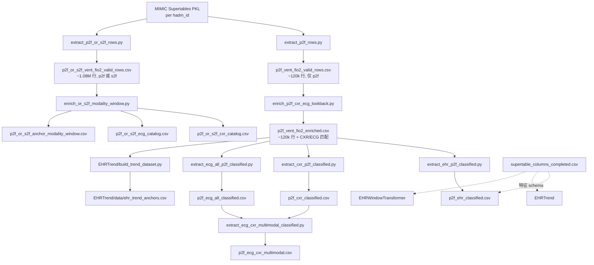

# Waveform_CXR_EHR

MIMIC-IV **EHR supertable** 与 **CXR**、**ECG waveform** 的对齐、特征抽取，以及 ARDS 严重程度 / 趋势预测实验。

本仓库的核心任务：以 EHR 时间序列行为 anchor，在 anchor 前 **6–18 小时** 回看窗口内匹配 CXR / ECG，用于单模态与多模态 baseline 和 Transformer 实验。

---

## 仓库结构

```
Waveform_CXR_EHR/
├── data/                          # 数据抽取脚本 + 主要 CSV（见下文）
├── supertable_columns_completed.csv   # EHR 特征 schema（与 data/ 下同名文件相同）
├── BaselineExperiment/            # ARDS 三分类 baseline（EHR / CXR / ECG / 多模态）
├── EHRTrend/                      # p2f/s2f 趋势预测、next-step、forward MLP
├── EHRWindowTransformer/          # 基于 anchor + history window 的 Transformer
├── EHREncoderTransformer/         # Symile 预处理 + Row MLP + causal Transformer（单阶段分类）
├── EHREncoderTransformerEmbedPred/  # 上述 + anchor embed 预测（两阶段：预训练 + 微调）
├── CXREncoderTransformer/         # CXR + Transformer（ARDS 变化预测）
├── ECGEncoderTransformer/         # ECG + Transformer
├── figures/                       # 实验对比图、t-SNE 等可视化
├── logs/                          # Slurm 训练日志
├── models/encoders/               # 共享 EHR / CXR / ECG encoder
└── experiment1(old)/              # 旧版 CXR–supertable–waveform 全量匹配（已归档）
```

---

## 关键概念

| 术语 | 含义 |
|------|------|
| **Supertable** | MIMIC-IV 按 `hadm_id` 存储的宽表 PKL，每行一个 EHR 时间点（`index` 列 = 时间戳） |
| **p2f_vent_fio2** | PaO₂/FiO₂（氧合指数），ARDS 分级的核心指标 |
| **s2f_vent_fio2** | SpO₂/FiO₂（饱和度氧合指数），p2f 的替代/补充指标 |
| **p2f_class** | ARDS 严重程度三分类：`0=Severe (<100)`，`1=Moderate (100–200)`，`2=Mild (200–300)`；`>300` 或缺失则排除 |
| **CXR_signal / ECG_signal** | 该行在 `[anchor−18h, anchor−6h]` 内是否成功匹配到 CXR / ECG（0/1） |
| **Anchor** | 模型预测的目标时间点（通常是一条有 p2f 或 s2f 的 supertable 行） |
| **History** | anchor 之前若干小时内的 EHR 序列，供 Transformer / trend 模型使用 |

---

## 数据流水线



> **注意**：当前 `p2f_vent_fio2_enriched.csv` 由 **p2f-only** 抽取（120k 行）生成。更新的 `p2f_or_s2f_vent_fio2_valid_rows.csv`（1M+ 行）主要用于 **EHRTrend / EHRWindowTransformer** 的 anchor 与标签，尚未重新跑 enrich。

---

## `data/` 目录 CSV 说明

### 1. 原始抽取（来自 Supertables）

| 文件 | 行数（约） | 生成脚本 | 含义 |
|------|-----------|----------|------|
| `p2f_vent_fio2_valid_rows.csv` | 120,060 | `data/extract_p2f_rows.py` | 所有 **`p2f_vent_fio2` 非空** 的 supertable 行；166 列 EHR 特征 + `hadm_id` |
| `p2f_or_s2f_vent_fio2_valid_rows.csv` | 1,076,516 | `data/extract_p2f_or_s2f_rows.py` | **`p2f_vent_fio2` 或 `s2f_vent_fio2` 至少一个非空**；在 p2f-only 基础上多了 `has_s2f_vent_fio2`、`has_p2f_vent_fio2`、`s2f/p2f_vent_fio2_severity`、`*_severity_change_12to24h` 等列；**EHRTrend / EHRWindowTransformer 的 anchor 表** |
| `p2f_or_s2f_cxr_catalog.csv` | — | `data/enrich_or_s2f_modality_window.py` | cohort 内所有 in-admission **CXR**（`dicom_id`, `subject_id`, `hadm_id`, `supertable_datetime`）；供 `[t−24h, t−12h]` window 索引 |
| `p2f_or_s2f_cxr_catalog_labeled.csv` | ~166k | `data/enrich_cxr_catalog_anchor_labels.py` | 每条 CXR 对齐 **12–24h 后的 anchor**，附带 `has_s2f/p2f`、severity、`*_severity_change_12to24h`（长表，一对多） |
| `p2f_or_s2f_ecg_catalog.csv` | — | 同上 | cohort 内所有 in-admission **ECG**（`wf_*`, `subject_id`, `hadm_id`） |
| `p2f_or_s2f_anchor_modality_window.csv` | 1,076,516 | 同上 | 每个 anchor + `CXR_window_count`, `ECG_window_count`, `CXR_signal`, `ECG_signal`（窗口内是否有模态） |

两者共同列：`index`（时间戳）、 demographics、labs、vitals、vent、SOFA 等 supertable 全部 EHR 字段。

### 2. 模态 enrich（CXR + ECG 回看匹配）

| 文件 | 行数（约） | 生成脚本 | 含义 |
|------|-----------|----------|------|
| `p2f_vent_fio2_enriched.csv` | 120,060 | `data/enrich_p2f_cxr_ecg_lookback.py` | 在 p2f-only 行上，为每个 anchor 在 **[t−18h, t−6h]** 内找最近 CXR / ECG；新增 `dicom_id`、`subject_id`、`supertable_datetime`、`wf_*`（波形路径等）、`CXR_signal`、`ECG_signal` |

Lookback 窗口与 enrich 脚本一致（6–18 小时，非 README 旧版写的 6–12h）。

### 3. ARDS 三分类子集（baseline 用）

均在 `p2f_vent_fio2_enriched.csv` 基础上过滤，并添加 **`p2f_class`** 列：

| 文件 | 行数（约） | 生成脚本 | 过滤条件 | 用途 |
|------|-----------|----------|----------|------|
| `p2f_ehr_classified.csv` | 87,661 | `data/extract_ehr_p2f_classified.py` | p2f 在 ARDS 范围 (≤300) | **EHR-only** baseline |
| `p2f_cxr_classified.csv` | 7,543 | `data/extract_cxr_p2f_classified.py` | `CXR_signal=1` + 有效 `dicom_id` + p2f_class | **CXR-only** baseline |
| `p2f_ecg_all_classified.csv` | 2,115 | `data/extract_ecg_all_p2f_classified.py` | `ECG_signal=1`；**展开** lookback 内全部 ECG（非 enrich 的“最近一条”） | **ECG-only** baseline |
| `p2f_ecg_cxr_multimodal.csv` | 2,115 | `data/extract_ecg_cxr_multimodal_classified.py` | `p2f_cxr_classified` 与 `p2f_ecg_all_classified` 按 **`index` 内连接** | **ECG+CXR** 多模态 baseline |

`p2f_class` 映射：

- `0` Severe：p2f < 100  
- `1` Moderate：100 ≤ p2f < 200  
- `2` Mild：200 ≤ p2f ≤ 300  

### 4. 特征 schema（不是患者数据）

| 文件 | 行数 | 含义 |
|------|------|------|
| `data/supertable_columns_completed.csv` | 162 | 每个 EHR 列的 **dtype、是否 one-hot、imputation、normalization、是否作为模型输入** 等；训练 EHR encoder / Transformer 时读取 |
| `supertable_columns_completed.csv`（仓库根目录） | 162 | 与 `data/` 下 **内容相同** 的副本；部分脚本从根目录解析 project root |

### 5. EHRTrend 专用

| 文件 | 行数（约） | 生成脚本 | 含义 |
|------|-----------|----------|------|
| `EHRTrend/data/ehr_trend_anchors.csv` | 118,409 | `EHRTrend/build_trend_dataset.py` | 从 enriched CSV 构建的 **趋势 anchor**：每行含 `subject_id`、`index`、`p2f_vent_fio2`、`prev_state`、`curr_state`、`trend_label`（0=decrease, 1=remain, 2=increase）、`n_window_points` |

---

## 各实验读哪些 CSV

| 模块 | 主要 CSV |
|------|----------|
| `BaselineExperiment/EHRUni` | `p2f_ehr_classified.csv` + `p2f_vent_fio2_enriched.csv`（history） |
| `BaselineExperiment/CXRUni` | `p2f_cxr_classified.csv` |
| `BaselineExperiment/ECGUni` | `p2f_ecg_all_classified.csv` |
| `BaselineExperiment/MultimodalECGCXR` | `p2f_ecg_cxr_multimodal.csv` |
| `BaselineExperiment/MultimodalEHRCXR` | `p2f_ehr_classified.csv` + `p2f_cxr_classified.csv` + enriched |
| `BaselineExperiment/MultimodalEHRECG` | `p2f_ehr_classified.csv` + `p2f_ecg_all_classified.csv` + enriched |
| `EHRTrend`（trend / nextstep / forward MLP） | anchor: `p2f_or_s2f_vent_fio2_valid_rows.csv`；history/enriched: `p2f_vent_fio2_enriched.csv`；schema: `supertable_columns_completed.csv` |
| `EHRWindowTransformer` | anchor/labels: `p2f_or_s2f_vent_fio2_valid_rows.csv`；history: enriched 或 or_s2f（视 modality 而定） |
| `EHREncoderTransformer` | anchor/history: `p2f_or_s2f_vent_fio2_valid_rows.csv`；schema: `supertable_columns_completed.csv`；可选 enriched join |
| `EHREncoderTransformerEmbedPred` | 同上 + anchor@t 行用于 embed loss target |

---

## 如何重新生成数据

在仓库根目录执行（需访问 HPC 上的 MIMIC supertables、CXR metadata、waveform 路径）：

```bash
# Step 1a: 仅 p2f（旧 pipeline，生成 enriched 的输入）
python data/extract_p2f_rows.py
# → data/p2f_vent_fio2_valid_rows.csv

# Step 1b: p2f 或 s2f（新 pipeline，EHRTrend / WindowTransformer anchor）
python data/extract_p2f_or_s2f_rows.py
# 或: sbatch data/run_extract_p2f_or_s2f_rows.sh
# → data/p2f_or_s2f_vent_fio2_valid_rows.csv

# Step 1c: p2f_or_s2f 的 CXR/ECG [t-24h, t-12h] 模态目录 + anchor 窗口标记
python data/enrich_or_s2f_modality_window.py
# 或: sbatch data/run_enrich_or_s2f_modality_window.sh
# → data/p2f_or_s2f_cxr_catalog.csv, p2f_or_s2f_ecg_catalog.csv,
#    p2f_or_s2f_anchor_modality_window.csv
# 可选 --write-matches 输出 long-format 匹配表

# Step 2: CXR/ECG lookback enrich（默认读 p2f-only；可 --input 指定 or_s2f）
python data/enrich_p2f_cxr_ecg_lookback.py \
  --input data/p2f_vent_fio2_valid_rows.csv \
  --output data/p2f_vent_fio2_enriched.csv

# Step 3: 各模态 classified 子集
python data/extract_ehr_p2f_classified.py
python data/extract_cxr_p2f_classified.py
python data/extract_ecg_all_p2f_classified.py
python data/extract_ecg_cxr_multimodal_classified.py

# Step 4（可选）: EHRTrend anchors
python EHRTrend/build_trend_dataset.py \
  --source_csv data/p2f_vent_fio2_enriched.csv \
  --output_csv EHRTrend/data/ehr_trend_anchors.csv
```

数据文件体积较大，未纳入 git；请在本机/HPC 按上述步骤生成。

---

## 旧版 pipeline（`experiment1(old)/`）

早期实验按 **同一小时** 对齐 CXR + supertable + waveform，与当前 p2f lookback pipeline **逻辑不同**：

| 步骤 | 脚本 | 输出 |
|------|------|------|
| CXR–supertable 匹配 | `experiment1(old)/run_full_match.py` | `cxr_supertable_matched.csv` |
| 合并 waveform | `experiment1(old)/merge_cxr_waveform.py` | `cxr_supertable_waveform_matched.csv` |

旧 baseline（`experiment1(old)/baseline*`）直接使用 `cxr_supertable_waveform_matched.csv`。新实验请使用 `data/p2f_*.csv` 系列。

---

## 外部数据路径（HPC）

| 资源 | 默认路径 |
|------|----------|
| MIMIC Supertables | `/hpc/group/kamaleswaranlab/mimic_iv/sepy_output/mimic-supertables/Supertables/` |
| MIMIC-CXR metadata | `.../mimic-cxr-2.0.0-metadata.csv.gz` |
| MIMIC-IV admissions | `.../mimic-iv-3.1-decompress/hosp/admissions.csv` |
| ECG waveform 路径 | `.../Waveform/MIMIC_waveform/MatchedFilePath/MIMIC4MathedPath.csv` |
| CXR 图像根目录 | `/hpc/group/kamaleswaranlab/mimic_cxr/mimic_cxr_jpg` |

---

## 常见困惑 FAQ

**Q: `p2f_vent_fio2_valid_rows` 和 `p2f_or_s2f_vent_fio2_valid_rows` 有什么区别？**  
A: 前者只保留有 **p2f** 的行（~12 万）；后者保留 **p2f 或 s2f** 任一有值的行（~108 万），并带 severity / 12–24h change 标签列。新模型用后者作 anchor。

**Q: 为什么 enriched 只有 12 万行，而 or_s2f 有 100 多万行？**  
A: enriched 目前仍由 **p2f-only** 输入生成。若要对 or_s2f 全量 enrich，需对 `p2f_or_s2f_vent_fio2_valid_rows.csv` 重新跑 `enrich_p2f_cxr_ecg_lookback.py`（耗时较长）。

**Q: `p2f_ecg_all_classified` 和 enriched 里的 ECG 列有何不同？**  
A: enriched 每行只保留 lookback 内 **最近一条** ECG；`extract_ecg_all_p2f_classified.py` 把 lookback 内 **所有** ECG 展开成多行（同一 `index` 可对应多条 waveform）。

**Q: 根目录和 `data/` 下各有一份 `supertable_columns_completed.csv`？**  
A: 是同一 schema 文件的副本；脚本通过该文件定位 project root 并解析 EHR 特征。

**Q: `index` 列是什么？**  
A: Supertable 行的时间戳（`recorded_time` / anchor 时刻），多数脚本将其 parse 为 datetime 用于时间窗匹配。

---

## 实验总览：p2f/s2f 严重程度**变化**预测（12→24h）

本节汇总近期在 **EHR-only** 模型上的一系列实验：用 `[t−24h, t−12h]` 的 EHR 历史预测 anchor 时刻 `t` 的 `s2f/p2f_severity_change_12to24h`（3 类：恶化 / 不变 / 改善）。

### 任务与数据

| 项目 | 说明 |
|------|------|
| **输入窗口** | `[t−24h, t−12h]` 内的 EHR 行序列（默认不含 anchor@t 行） |
| **标签** | anchor 行的 `s2f_severity_change_12to24h` / `p2f_severity_change_12to24h` |
| **Anchor 表** | `data/p2f_or_s2f_vent_fio2_valid_rows.csv`（过滤空窗口后约 **435k** anchors） |
| **Symile 预处理** | 训练集上拟合 percentile 特征 + presence indicator → `input_dim=194` |
| **划分** | stratified 70% / 15% / 15%（train / val / test） |
| **多数类基线** | s2f **68.2%**，p2f **51.1%**（test 集） |

### 模型架构对比

| 模型 | 目录 | 结构要点 | 训练方式 |
|------|------|----------|----------|
| **EHRWindowTransformer** | [`EHRWindowTransformer/`](EHRWindowTransformer/) | 原始 EHR 特征 → 直接 Transformer → dual heads | 单阶段 |
| **EHREncoderTransformer** | [`EHREncoderTransformer/`](EHREncoderTransformer/) | Symile pct+indicator → Row MLP → causal Transformer → dual heads | 单阶段 |
| **EHREncoderTransformerEmbedPred** | [`EHREncoderTransformerEmbedPred/`](EHREncoderTransformerEmbedPred/) | 同上 + 从窗口预测 anchor@t 的 row embedding | **两阶段**：embed 预训练 → cls 微调 |

三个模型共享同一 anchor 表与 lookback 设定，区别主要在于 **输入预处理**、**是否有 embed 辅助损失**、**训练策略**。

### 实验结果汇总

下表为各次 Slurm 实验的 **test set** 准确率（`acc_s2f` / `acc_p2f`）。加粗为当前最佳。

| 实验 | Job / 输出目录 | 主要配置 | acc_s2f | acc_p2f | 结论 |
|------|----------------|----------|---------|---------|------|
| **EHRWindowTransformer** | `47103601` / `EHRWindowTransformer/output_direct_window/` | 无 Symile；DirectWindowTransformer | 57.2% | 55.7% | 低于多数类基线；loss ~1.78 |
| **EHREncoderTransformer baseline** | `47745355` / `EHREncoderTransformer/output/` | `class_weights=True`, `p2f_weight=10`, `lr=5e-4` | 44.8% | 46.0% | **loss 卡在 ~1.09**（≈ln3），验证预测单类塌缩 |
| **EmbedPred baseline** | `47748678` / `EHREncoderTransformerEmbedPred/output_twophase/` | 两阶段；预训练 checkpoint 有 bug；`class_weights=True` | 48.9% | 43.4% | 预训练几乎未收敛即进入微调 |
| **EmbedPred Exp A** | `47753034` / `output_twophase_expA/` | 仅修复预训练衔接（`pretrain_resume=last`, `min_epochs=10`）；仍用 class weights | 31.6% | 48.3% | s2f 更差（过度预测少数类） |
| **EmbedPred Exp B** | `47753016` / `output_twophase_expB/` | Exp A + **`--no-use_class_weights`** + label smoothing + grad clip | 68.3% | 54.1% | 首次稳定超过 s2f 多数类基线 |
| **EmbedPred Exp C** | `47753017` / `output_twophase_expC/` | Exp B + `lr=1e-4`, `p2f_weight=5`, `finetune_epochs=80` | **69.1%** | **57.6%** | **EmbedPred 最佳** |
| **EHREncoderTransformer Fix-A** | `47789415` / `output_fixA/` | 去掉 class weights（新默认） | 68.4% | 51.4% | loss 从 ~1.09 降至 ~0.91，训练恢复 |
| **EHREncoderTransformer Fix-B** | `47789416` / `output_fixB/` | Fix-A + 显式 grad_clip / label_smoothing | 17.2% | 51.1% | 单次运行数值异常（NaN），可忽略 |
| **EHREncoderTransformer Fix-C** | `47789417` / `output_fixC/` | Fix-A + `lr=1e-4`, `p2f_weight=5`, grad_clip, label_smoothing | **69.0%** | **57.5%** | **单阶段最佳**；三类均有预测 |

> 日志路径：`logs/ehr-*-<jobid>.out`；完整指标见各目录下 `results.json` 与 `classification_report_test.json`。

### 关键问题与改进

#### 1. Class weights 导致 loss「看似不训练」

- **现象**：`EHREncoderTransformer` baseline 的 `train_loss` 长期停在 **~1.09**（接近 3 类随机 CE `ln(3)≈1.10`），但 `param_l2` 持续增长，说明参数在更新。
- **根因**：`inverse_freq` class weights 使加权 CE 对「塌缩到单类」不敏感；多数类 s2f 权重仅 ~0.31，loss 几乎不变。
- **修复**：默认关闭 class weights（`USE_CLASS_WEIGHTS=False`）；日志增加 **unweighted CE**（`train_ce_uw_s2f`）监控真实学习信号。
- **验证**：诊断脚本 [`EHREncoderTransformer/diagnose_training.py`](EHREncoderTransformer/diagnose_training.py) 实验 E 显示加权 CE ≈1.13、去掉权重后 loss 可降至 ~0.91。

#### 2. EmbedPred 预训练 checkpoint 衔接错误

- **现象**：baseline 预训练在第 1 epoch 就保存 `best.pt`（`val_embed≈0`），微调从近乎随机权重起步。
- **修复**（[`EHREncoderTransformerEmbedPred/train.py`](EHREncoderTransformerEmbedPred/train.py)）：
  - `PRETRAIN_MIN_EPOCHS=10`：前 10 epoch 不保存 best
  - `PRETRAIN_RESUME=last`：微调前加载 `last.pt` 而非过早的 `best.pt`
  - 预训练独立 early stopping（`PRETRAIN_EARLY_STOP_PATIENCE=10`）

#### 3. 训练稳定性与 checkpoint 选择

- **改进**（已移植到两个 Transformer 训练脚本）：
  - `label_smoothing=0.05`
  - `grad_clip=1.0`
  - `p2f_loss_weight` 从 10 降至 **5**
  - 双 checkpoint：`best_acc.pt`（按 `val_acc_s2f + val_acc_p2f`）+ `best_loss.pt`；评估默认用 `best_acc.pt`
  - 日志输出 `pred_diversity`（验证集预测覆盖几类）

#### 4. 输入与模型复杂度

- 诊断实验 C（Row MLP 线性探针，无 Transformer）可达 **~69%** acc，说明 **输入有分类信号**，问题不在数据或模型过复杂。
- Mini-overfit（2k 子集）未完全过拟合，表明全量训练仍需正则与稳定优化，但架构本身可学习。

### 推荐复现命令

**EmbedPred 最佳（Exp C）：**

```bash
sbatch --job-name=ehr-embed-best EHREncoderTransformerEmbedPred/run_train.sh \
  --output_dir EHREncoderTransformerEmbedPred/output_twophase_expC \
  --no-use_class_weights \
  --finetune_epochs 80 \
  --lr 1e-4 \
  --p2f_loss_weight 5.0
```

Checkpoint：`EHREncoderTransformerEmbedPred/output_twophase_expC/finetune/best_acc.pt`

**EHREncoderTransformer 最佳（Fix-C，单阶段）：**

```bash
sbatch --job-name=ehr-tr-best EHREncoderTransformer/run_train.sh \
  --output_dir EHREncoderTransformer/output_fixC \
  --no-use_class_weights \
  --grad_clip 1.0 \
  --label_smoothing 0.05 \
  --lr 1e-4 \
  --p2f_loss_weight 5.0
```

Checkpoint：`EHREncoderTransformer/output_fixC/best_acc.pt`

**快速诊断（~20 分钟）：**

```bash
sbatch EHREncoderTransformer/run_diagnose.sh
# 报告 → EHREncoderTransformer/output_diagnose/report.json
```

**消融批量提交：**

```bash
bash EHREncoderTransformer/run_fix_ablations.sh
```

### 可视化

- 实验对比曲线：[`figures/plot_embedpred_exp_runs.py`](figures/plot_embedpred_exp_runs.py) → `figures/ehr_embedpred_exp_runs/`
- t-SNE 嵌入可视化：[`figures/plot_tsne_embedpred.py`](figures/plot_tsne_embedpred.py)

### 经验结论

1. **超过多数类基线**（s2f > 68%, p2f > 51%）的关键是 **去掉 class weights** + **稳定训练**（grad clip、label smoothing、较低 lr），而非增大模型。
2. **EmbedPred 两阶段** 与 **EHREncoderTransformer 单阶段** 在修复后达到相近精度（~69% / ~58%），embed 预训练对最终分类增益有限，但两阶段框架仍可用于表征学习分析。
3. 监控指标应看 **unweighted CE** 与 **pred diversity**，不要仅看加权 `train_loss`——后者在 class weights 下会「假性平坦」。
